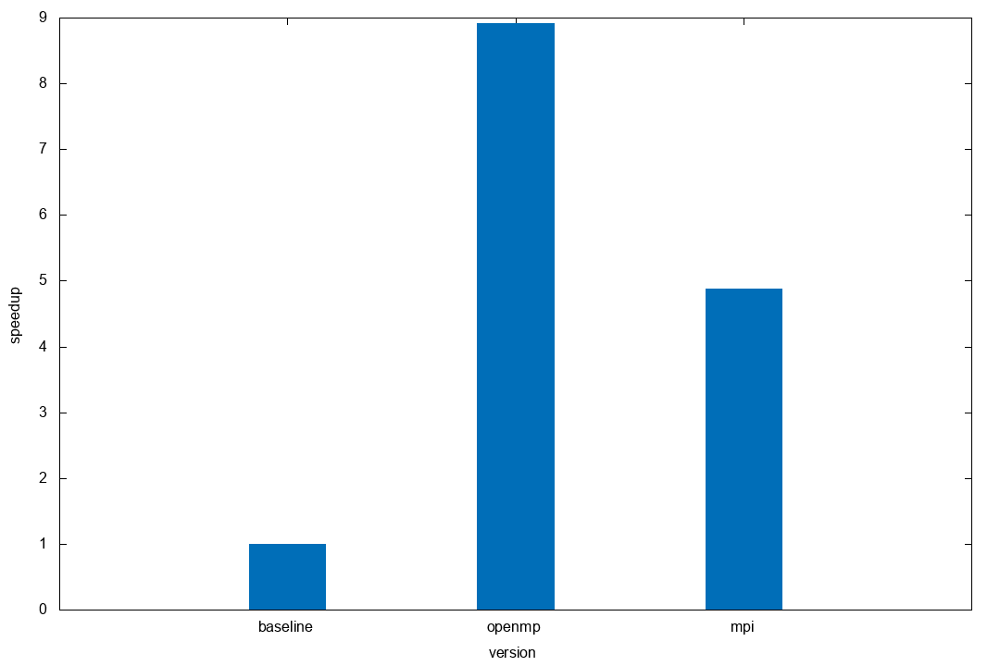

# Heat equation
Heat equation solver with MPI+OpenMP

### Requirements
Setup environment modules.
```bash
source env.sh
```
### Usage
#### Compile
Compile project with `make`.

#### Test
Run test suite with `make test`

## Results

Speedups obtained 16 threads for openmp, 16 processus for mpi.

**Processors:** Intel(R) Xeon(R) CPU E5-2670 v2 @ 2.50GHz

**Compiler:** gcc 9.1.0

**MPI Implementation:** OpenMPI 3.1.4
